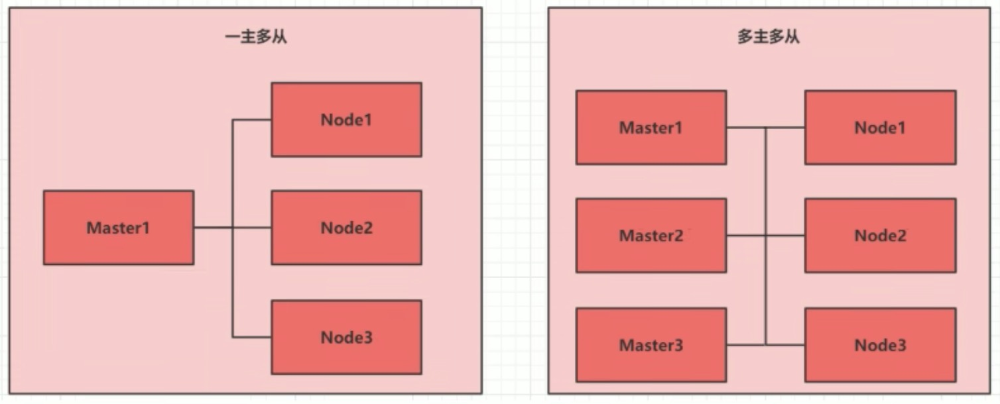
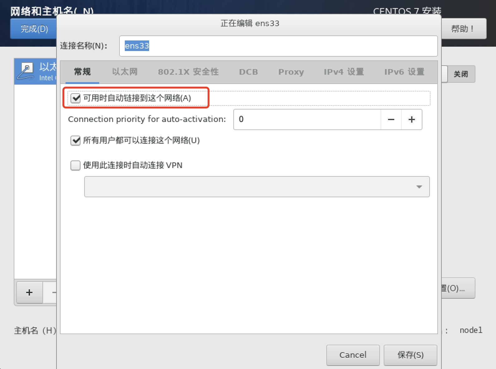
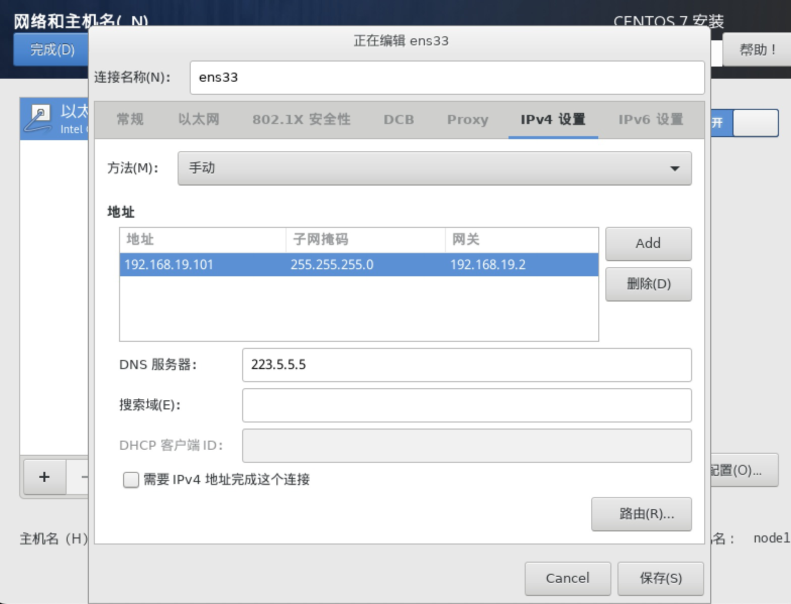
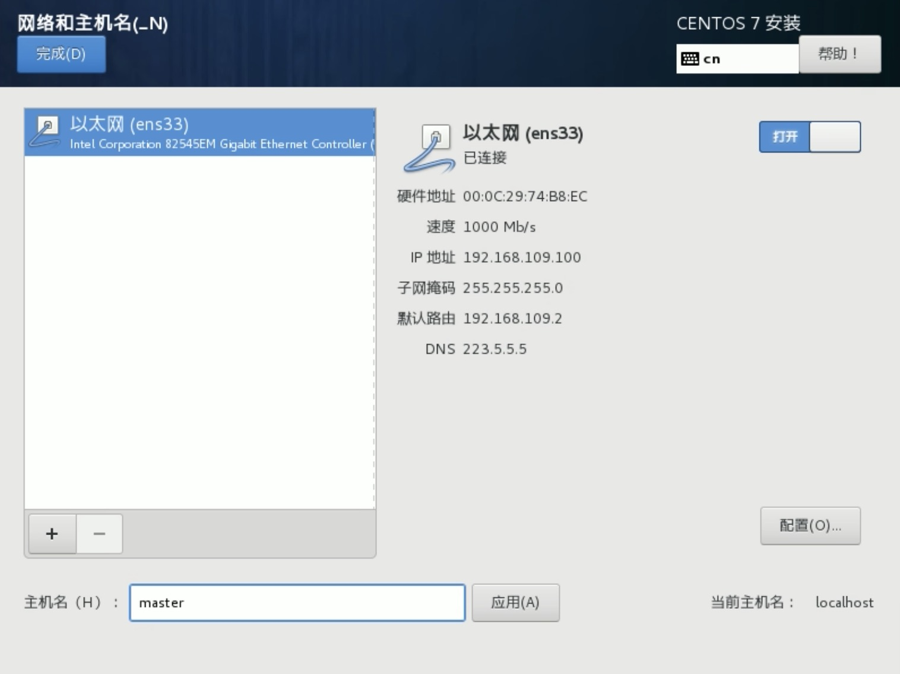

# kubernetes环境搭建
    本章节介绍如何搭建 kubernetes 的集群环境
## 2.1 环境规划
### 2.1.1 集群类型
kubernetes 集群大体分为两类: **一主多从** 和 **多主多从**
- **一主多从**: 一台 Master节点和多台Node节点, 简单搭建, 但是有单击故障风险, 适合用于测试环境
- **多主多从**: 多台 Master节点和多台Node节点, 搭建麻烦, 安全性高, 适用于生产环境


> 说明: 为了测试简单, 本次搭建的是一主两从 类型集群

### 2.1.2 安装方式
kubernetes 有多种部署方式, 目前主流的方式有 kubeadm, minikube, 二进制包
- **minikube**: 一个用于快速搭建单节点 kubernetes 的工具
- **kubeadm**: 一个用于快速搭建 kubernetes 的工具
- **二进制包**: 从官网下载每个组件的二进制包, 依次去安装, 此方式对于理解 kubernetes 组件更加有效

> 说明: 现在需要安装 kubernetes 的集群搭建环境, 但又不想过于麻烦, 所以选择使用 kubeadm 方式

### 2.1.3 主机规划
| 作用    | IP地址           | 操作系统             | 配置                  |
| --     | --              | --                  | --                    |
| Master | 192.168.111.100 | Centos7 基础设施服务器 | 2颗 CPU 2G内存 50G硬盘 |
| Node1  | 192.168.111.101 | Centos7 基础设施服务器 | 2颗 CPU 2G内存 50G硬盘 |
| Node2  | 192.168.111.102 | Centos7 基础设施服务器 | 2颗 CPU 2G内存 50G硬盘 |

## 2.2 环境搭建
    本次环境搭建需要三台 linux 系统 (一主二从), 内置 centos7 系统
    然后在每台linux中分别安装: 
    docker(18.06.3), kubeadm (1.17.4), kubeadm (1.17.4), kubeadm (1.17.4) 程序

### 2.2.1 主机安装
安装虚拟机过程中注意下面选项的设置: 
- 操作系统环境: CPU(2C) 内存(2G), 硬盘(50G)
- 语言选择: 中文简体
- 软件选择: 设施服务器
- 分区选择: 自动分区
- 网络配置: 按照下面配置网络地址信息
```
# 注: 网段虚自行查看配置 !!!
网络地址: 192.168.19.100 (每台主机都不一样, 分别为100, 101, 102)
子网掩码: 255.255.255.0
默认网关: 192.168.19.2
DNS:     223.5.5.5 # DNS: 可以与网关一直
```
- 网络配置: 点击常规 勾选可用时自动连接到这个网络

- 网络配置: 如下图点击保存

- 主机名设置: 按照下面信息设置主机名
```
master节点: master
node节点: node1
node节点: node2
```

### 2.2.2 环境初始化
1). 检查系统版本
```
# 此方式下安装kubernetes集群要求Centos版本要在7.5或以上
[root@master ~]# cat /etc/redhat-release 
CentOS Linux release 7.9.2009 (Core)
```

2).主机名解析
为了方便后面集群节点间的直接调用, 在配置一下主机名解析, 企业中推荐使用内部DNS服务器
```
# 主机名成解析 编辑三台服务器的/etc/host文件, 添加下面内容
192.168.111.100 master
192.168.111.101 node1
192.168.111.102 node2
```

3).时间同步
kubernetes 要求集群中的节点时间必须一致, 这里直接使用 chronyd 服务从网络同步时间.
企业中建议配置内部的时间同步服务器
```shell
# 启动 chronyd 服务
[root@master ~]# systemctl start chronyd
# 设置 chronyd 服务开机自启
[root@master ~]# systemctl enable chronyd
# chronyd 服务启动稍等几秒钟, 就可以使用date命令验证时间
[root@master ~]# date
2022年 11月 09日 星期三 10:11:52 CST
# 如果时间同步失败可以参考: http://t.zoukankan.com/Renqy-p-12987125.html
```

4). 禁用 iptables和firewalld 服务
kubernetes和docker 在运行中会产生大量的 iptables规则, 为了不让系统规则跟他们混淆, 直接关闭系统的规则
```shell
# 关闭 firewalld 服务
[root@master ~]# systemctl stop firewalld
[root@master ~]# systemctl disable firewalld
# 关闭 iptables 服务
[root@master ~]# systemctl stop iptables
Failed to stop iptables.service: Unit iptables.service not loaded.
[root@master ~]# systemctl disable iptables
Failed to execute operation: No such file or directory

```

5). 禁用selinux
selinux 是 linux 系统下的一个安全服务, 如果不关闭它, 在安装集群中会产生各种各样的奇葩问题
```shell
# 编辑  /etc/selinux/config 文件, 修改 SELINUX值为 disabled
# 注意修改完毕之后需要重启 linux 服务
SELINUX=disabled
```

6). 禁用swap分区
swap分区指的是虚拟内存分区, 他的作用是在物理内存使用完后, 将磁盘空间虚拟成内存来使用,
启动swap设备会对系统的性能产生非常负面的影响, 因此kubernetes要求每个节点都要禁用swap设备
但是如果因为某些原因确实不能关闭swap分区, 就需要在集群安装过程中通过明确的参数进行配置说明
```shell
# 编辑分区配置文件 /etc/fstab, 注释掉 swap 分区一行
# 注意修改完毕之后需要重启linux服务
/dev/mapper/centos-root /                       xfs     defaults        0 0
UUID=bebcc36c-5eb5-46f5-b188-2c4038284fed /boot                   xfs     defaults        0 0
# /dev/mapper/centos-swap swap                    swap    defaults        0 0
```

7). 修改 linux 的内核参数(kubernetes明确要求我们要去做的)
```shell
# 修改 linux 的内核参数, 添加网桥过滤和地址转发功能
# 编辑 /etc/sysctl.d/kubernetes.conf文件, 添加如下配置: 
net.bridge.bridge-nf-call-ip6tables = 1
net.bridge.bridge-nf-call-iptables = 1
net.ipv4.ip_forward = 1

# 重新加载配置
[root@node2 ~]# sysctl -p

# 加载网桥过滤模块
[root@node2 ~]# modprobe br_netfilter

# 查看网桥过滤模块是否加载成功
[root@node2 ~]# lsmod | grep br_netfilter
br_netfilter           22256  0 
bridge                151336  1 br_netfilter

```

8). 配置ipvs功能
在 kubernetes 中 service 有两种代理模式, 一种是基于iptables的, 一种是基于ipvs的
两者比较的话, ipvs 的性能明显要高一些, 但是如果要使用它, 需要手动载入ipvs模块
```shell
# 1.安装ipset和ipvsadm
[root@node2 ~]# yum install ipset ipvsadmin -y

# 2.添加需要加载的模块写入脚本文件
[root@node2 ~]# cat <<EOF>>  /etc/sysconfig/modules/ipvs.modules
#!/bin/bash
modprobe -- ip_vs
modprobe -- ip_vs_rr
modprobe -- ip_vs_wrr
modprobe -- ip_vs_sh
modprobe -- nf_conntrack_ipv4
EOF

# 3. 为脚本文件添加执行权限
[root@node2 ~]# chmod +x /etc/sysconfig/modules/ipvs.modules

# 4. 执行脚本文件
[root@node2 ~]# /bin/bash /etc/sysconfig/modules/ipvs.modules

# 5. 查看对应的模块是否加载成功
[root@node2 ~]# lsmod |grep -e ip_vs -e nf_conntrack_ipv4
# 执行成功
nf_conntrack_ipv4      15053  0 
nf_defrag_ipv4         12729  1 nf_conntrack_ipv4
ip_vs_sh               12688  0 
ip_vs_wrr              12697  0 
ip_vs_rr               12600  0 
ip_vs                 145458  6 ip_vs_rr,ip_vs_sh,ip_vs_wrr
nf_conntrack          139264  2 ip_vs,nf_conntrack_ipv4
libcrc32c              12644  3 xfs,ip_vs,nf_conntrack


```
注: 如 MAC 网络连接有问题, 可以参考如下连接
```http
https://blog.csdn.net/bokfp/article/details/112202966?utm_medium=distribute.pc_aggpage_search_result.none-task-blog-2~aggregatepage~first_rank_ecpm_v1~rank_v31_ecpm-4-112202966-null-null.pc_agg_new_rank&utm_term=macos%20nat%E6%A8%A1%E5%BC%8F%E7%BD%91%E7%BB%9C%E4%B8%8D%E9%80%9A%20vmware&spm=1000.2123.3001.4430
```

9). 重启服务器
上面步骤完成之后, 需要重新启动Linux系统
```shell
[root@node2 ~]# reboot

# 重启后检查
[root@master ~]# getenforce 
Disabled
[root@master ~]# free -m 
              total        used        free      shared  buff/cache   available
Mem:           1819         193        1484           9         140        1478
Swap:             0           0           0

```

### 2.2.3 安装docker
```shell
# 1. 切换镜像源
[root@master ~]# yum-config-manager --add-repo http://mirrors.aliyun.com/docker-ce/linux/centos/docker-ce.repo

# 2. 查看当前镜像源中支持的docker版本
[root@master ~]# yum list docker-ce --showduplicates

# 3. 安装特定版本的docker-ce 
# 必须指定--setopt=obsoletes=0, 否则yum会自动安装更高的版本
[root@master ~]# yum install --setopt=obsoletes=0 docker-ce-18.06.3.ce-3.el7 -y

# 4. 添加一个配置文件
# Docker在默认情况下使用的Cgroup Driver 为 cgroupfs, 而kubernetes推荐使用systemd来代替cgroupfs
[root@master ~]# mkdir /etc/docker
[root@master ~]# cat <<EOF>> /etc/docker/daemon.json
{
    "exec-opts": ["native.cgroupdriver=systemd"],
    "registry-mirrors": ["https://kn0t2bca.mirror.aliyuncs.com"]
}
EOF

# 5. 启动docker
[root@master ~]# systemctl restart docker
# 设置开机自启动
[root@master ~]# systemctl enable docker

# 6. 检查docker状态和版本
[root@master ~]# docker version
```

### 2.2.4 安装kubernetes组件
```shell
# 1. 由于Kubernetes的镜像源在国外, 速度较慢, 这里切换成国内镜像源
# 编辑 /etc/yum.repos.d/kubernetes.repo, 添加下面的配置
[root@master ~]# vim /etc/yum.repos.d/kubernetes.repo
[kubernetes]
name=Kubernetes
baseurl=http://mirrors.aliyun.com/kubernetes/yum/repos/kubernetes-el7-x86_64
enabled=1
gpgcheck=0
repo_gpgcheck=0
gpgkey=http://mirrors.aliyun.com/kubernetes/yum/doc/yum-key.gpg
       http://mirrors.aliyun.com/kubernetes/yum/doc/rpm-package-key.gpg

# 2. 安装kubeadm, kubelet和kubectl
[root@master ~]# yum install --setopt=obsoletes=0 kubeadm-1.17.4-0 kubelet-1.17.4-0 kubectl-1.17.4-0 -y

# 3. 配置kubelet的cgroup
# 编辑 /etc/sysconfig/kubelet, 添加下面的配置:
[root@master ~]# vim /etc/sysconfig/kubelet
KUBELET_CGROUP_ARGS="--cgroup-driver=systemd"
KUBE_PROXY_MODE="ipvs"

# 4. 设置开机自启动
[root@master ~]# systemctl enable kubelet

```

### 2.2.5 准备集群镜像
```shell
# 1. 在安装Kubernetes集群之前, 必须要提前准备好集群需要的镜像, 所需镜像可以通过命令查看
[root@master ~]# kubeadm config images list

# 2. 下载镜像
# 次镜像在Kubernetes的仓库中, 由于网络原因, 无法连接, 下面提供了一种替代方法

# 3. 创建一个脚本 将内容复制到脚本中并赋予权限执行
[root@master ~]# vim images.sh 
[root@master ~]# chmod +x images.sh
[root@master ~]# /bin/bash images.sh

images=(
    kube-apiserver:v1.17.4
    kube-controller-manager:v1.17.4
    kube-scheduler:v1.17.4
    kube-proxy:v1.17.4
    pause:3.1
    etcd:3.4.3-0
    coredns:1.6.5
)

images=(
    kube-apiserver:v1.17.17
    kube-controller-manager:v1.17.17
    kube-scheduler:v1.17.17
    kube-proxy:v1.17.17
    pause:3.1
    etcd:3.4.3-0
    coredns:1.6.5
)
for imageName in ${images[@]} ; do
	docker pull registry.cn-hangzhou.aliyuncs.com/google_containers/$imageName
	docker tag registry.cn-hangzhou.aliyuncs.com/google_containers/$imageName 		k8s.gcr.io/$imageName
	docker rmi registry.cn-hangzhou.aliyuncs.com/google_containers/$imageName
done

# 4. 检查镜像
[root@master ~]# docker images
REPOSITORY                           TAG                 IMAGE ID            CREATED             SIZE
k8s.gcr.io/kube-proxy                v1.17.17            3ef67d180564        22 months ago       117MB
k8s.gcr.io/kube-apiserver            v1.17.17            38db32e0f351        22 months ago       171MB
k8s.gcr.io/kube-controller-manager   v1.17.17            0ddd96ecb9e5        22 months ago       161MB
k8s.gcr.io/kube-scheduler            v1.17.17            d415ebbf09db        22 months ago       94.4MB
k8s.gcr.io/coredns                   1.6.5               70f311871ae1        3 years ago         41.6MB
k8s.gcr.io/etcd                      3.4.3-0             303ce5db0e90        3 years ago         288MB
k8s.gcr.io/pause                     3.1                 da86e6ba6ca1        4 years ago         742kB

```

### 2.2.6 集群初始化
下面开始集群初始化, 并将 node 节点加入到集群中
> 下面操作只需要在 <font color=red size=4>master</font> 节点执行
```shell
# 创建集群
kubeadm init \
--kubernetes-version=v1.17.4 \
--pod-network-cidr=10.244.0.0/16 \
--service-cidr=10.96.0.0/12 \
--ignore-preflight-errors=Swap \
--image-repository=registry.aliyuncs.com/google_containers \
--apiserver-advertise-address=192.168.111.100
# 如执行报错: 先执行 kubeadm reset, 正确日志如下, 记住日志后三行, 添加node节点时需要: 
# kubeadm join 192.168.111.100:6443 --token cf6u7y.kedbzol1t67xyh1q \
#     --discovery-token-ca-cert-hash sha256:8c4636956c700030b286d60e093f6956385a0eb9940265056a83ad7183d35a59

# 添加后查看 节点
[root@master ~]# kubectl get nodes
NAME     STATUS     ROLES    AGE     VERSION
master   NotReady   master   6m38s   v1.17.4
node1    NotReady   <none>   2m3s    v1.17.4
node2    NotReady   <none>   74s     v1.17.4

# 加载环境并生效
echo "export KUBECONFIG=/etc/kubernetes/admin.conf" >> ~/.bash_profile source ~/.bash_profile
```
正确日志: 
```
Your Kubernetes control-plane has initialized successfully!

To start using your cluster, you need to run the following as a regular user:

  mkdir -p $HOME/.kube
  sudo cp -i /etc/kubernetes/admin.conf $HOME/.kube/config
  sudo chown $(id -u):$(id -g) $HOME/.kube/config

You should now deploy a pod network to the cluster.
Run "kubectl apply -f [podnetwork].yaml" with one of the options listed at:
  https://kubernetes.io/docs/concepts/cluster-administration/addons/

Then you can join any number of worker nodes by running the following on each as root:

kubeadm join 192.168.111.100:6443 --token cf6u7y.kedbzol1t67xyh1q \
    --discovery-token-ca-cert-hash sha256:8c4636956c700030b286d60e093f6956385a0eb9940265056a83ad7183d35a59
```

### 2.2.7 安装网络插件
kubernetes支持多种网络插件, 比如 flannel, calico, canal 等等, 任选一种使用即可, 本次选择flannel
> 下面操作依旧只在 <font color=red size=4>master</font> 节点执行即可, 插件使用的是 DaemonSet 控制器, 他会在每个节点上都运行
```shell
# 如果下载失败: 科学上网+浏览器保存 || ../tool/kube-flannel.yml
[root@master ~]# wget https://raw.githubusercontent.com/coreos/flannel/master/Documentation/kube-flannel.yml

# 使用配置文件启动 fannel
[root@master ~]# kubectl apply -f kube-flannel.yml

# 稍等片刻, 再次查看集群节点状态
[root@master ~]# kubectl get node
NAME     STATUS   ROLES    AGE   VERSION
master   Ready    master   25m   v1.17.4
node1    Ready    <none>   20m   v1.17.4
node2    Ready    <none>   20m   v1.17.4

``` 
> <font color=red size=5>至此kubernetes的集群环境搭建完成!!!</font>

## 2.3 服务部署
接下来在Kubernetes集群中部署一个nginx程序, 测试下集群是否在正常工作.
```shell
#部署
[root@master ~]# kubectl create deployment nginx --image=nginx:1.14-alpine
#暴露端口
[root@master ~]# kubectl expose deployment nginx --port=80 --type=NodePort
#查看服务状态
[root@master ~]# kubectl get pods,svc
NAME                         READY   STATUS    RESTARTS   AGE
pod/nginx-6867cdf567-g9qmg   1/1     Running   0          2m45s

NAME                 TYPE        CLUSTER-IP      EXTERNAL-IP   PORT(S)        AGE
service/kubernetes   ClusterIP   10.96.0.1       <none>        443/TCP        53m
service/nginx        NodePort    10.96.169.239   <none>        80:30589/TCP   2m31s

```


