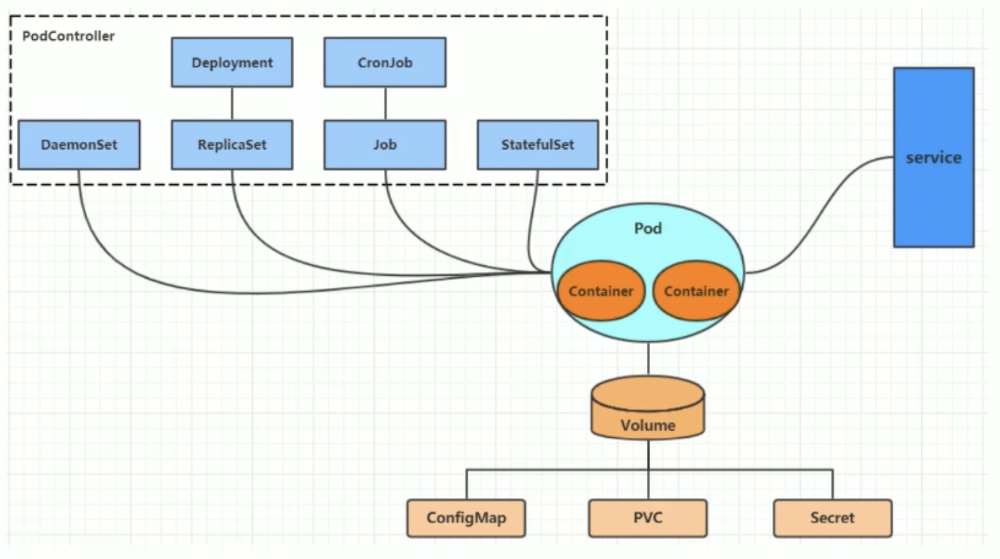

# kubernetes资源管理
本章节主要介绍yaml语法和Kubernetes的资源管理方式

## 3.1 资源管理介绍
在Kubernetes中, 所有的内容都抽象为资源, 用户需要通过操作资源来管理Kubernetes.
> kubernetes的本质上就是一个集群系统, 用户可以在集群中部署各种服务, 所谓的部署服务, 
> 其实就是在Kubernetes集群中运行一个小小的容器, 并将指定的程序跑在容器中.
>
> kubernetes的最小管理单位是Pod而不是容器, 所以只能将容器放在 <font color=red size=4>Pod</font>中, 
> 而Kubernetes一般也不会直接管理Pod, 而是通过<font color=red size=4>Pod控制器</font>来管理Pod的
>
> Pod可以提供服务之后, 就要考虑如何访问Pod中服务, kubernetes提供了<font color=red size=4>Service</font>资源实现
> 这个功能. 当然, 如果Pod中程序的数据需要持久化, kubernetes还提供了各种<font color=red size=4>存储</font>系统


> 学习kubernetes的核心, 就是学习如何对集群上的<font color=red size=3>Pod, Pod控制器, Service, 存储</font>等各种资源进行操作

## 3.2 YAML 语言介绍
YAML是一个类似于XML, JSON的标记性语言, 它强调以 **数据** 为中心, 并不是以标记语言为重点. 
因而YAML本身定义比较简单, 号称"一种人性化的数据格式语言"
> 对比下 XML: 
```xml
<ZS>
    <age>15</age>
    <address>TJU<address>
</ZS>
```
> 对比下 YAML
```yaml
ZS:
 age:15
 address:tju    
```


> YAML的语法比较简单, 主要有下面几个:
- 大小写敏感
- 使用缩进表示层级关系
- 缩进不允许使用tab, 只允许空格 (低版本限制)
- 缩进的空格数不重要, 只要相同层级的元素左对齐即可
- "#" 表示注释

> YAML 支持一下几种数据类型: 
- **纯量**: 单个的, 不可再分的值
- **对象**: 键值对的集合, 又称为映射(mapping) / 哈希(hash) / 字典(dictionary)
- **数组**: 一组按次序排列的值, 有称为序列(sequence) / list 列表
```yaml
# 纯量, 就是指的一个简单的值, 字符串
# 1. 布尔类型
c1: true(或者True)
# 2. 整数
c2: 123
# 3. 浮点数
c3: 3.1415926
# 4. null 类型
c4: ~  # 使用~表示 null
# 5. 日期类型
c5: 2022-10-11  # 必须使用ISO 8601格式, 即 yyyy-MM-dd
# 6. 时间类型
c6: 2018-02-17T15:02:31+08:00  # 时间使用ISO 8601格式, 时间和日期之间使用T连接, 最后使用+代表时区
# 7. 字符串类型
c7: zs  # 简单写法, 直接写值, 如果字符串中间有特殊字符, 必须使用双引号或单引号包裹
c8: line1
    line2  # 字符串过多的情况可以拆成多行, 每一行会被转化成一个空格


```
```yaml
# 对象
# 形式一(推荐): 
zs:
 age: 15
 address: tj
# 形式二(了解): 
zs: {age: 15, address: tj}
```
```yaml
# 数组
# 形式一(推荐):
address: 
 - shanghai
 - tianjin
# 形式二(了解):
address: [shanghai, tianjin]
```

> 提示: 
> 1. 书写 yaml 切记: 后面加一个空格
> 2. 如果需要将多段yaml配置放在一个文件中, 中间要使用 --- 分割
> 3. 下面是一个 yaml转json的网站, 可以通过它验证yaml是否书写正确
    > https://www.json2yaml.com/convert-yaml-to-json


## 3.3 资源管理方式
- 命令式对象管理: 直接使用命令去操作 kubernetes 资源
```shell
kubectl run nginx-pod --image=nginx:1.17.1 --port=80
```
- 命令式对象配置: 通过命令配置和配置文件去操作 kubernetes 资源
```
kubectl create/patch -f nginx-pod.yaml
```
- 声明式对象配置: 通过apply命令和配置文件去操作kubernetes资源(**apply 只用于创建和更新资源, 类似于 -a**)
```
kubectl apply -f nginx-pod.yaml
```

| 类型 | 操作对象 | 适用环境 | 优点 | 缺点 |
| -- | -- | -- | -- | -- |
| 命令式对象管理 | 对象 | 测试 | 简单 | 只能操作活动对象, 无法审计, 跟踪 |
| 命令式对象配置 | 文件 | 开发 | 可以审计, 跟踪 | 项目大时, 配置文件多, 操作麻烦 |
| 声明式对象配置 | 目录 | 开发 | 支持目录操作 | 意外情况下难以调试 |


### 3.3.1 命令式对象管理
**kubectl命令**
kubectl 是 kubernetes集群的命令工具, 通过它能够对集群本身进行管理, 并能够在集群上进行容器化应用的安装部署. kubectl命令的语法如下: 
```
kubectl [command] [type] [name] [flags]
```
**command**: 指定要对资源执行的操作, 例如: create, get, delete
**type**: 指定资源类型, 比如 deployment, pod, service
**name**: 指定资源的名称, 名称大小写敏感
**flags**: 指定额外的可选参数

```
# 查看所有pod
kubectl get pod

# 查看某个pod
kubectl get pod pod_name 

# 查看某个pod, 以yaml格式展示结果
kubectl get pod pod_name -o yaml
```
**资源类型**
kubernetes中所有的内容都抽象为资源, 可以通过下面的命令进行查看: 
```
kubectl api-resources
```
经常使用的资源有下面这些: 


<table>
  <tr>
    <th>资源分类</th>
    <th>资源名称</th>
    <th>缩写</th>
    <th>资源作用</th>
  </tr>
  <tr>
    <td rowspan="2">集群级别资源</td>
    <td>nodes</td>
    <td>no</td>
    <td>集群组成部分</td>
  </tr>
  <tr>
    <td>namespaces</td>
    <td>ns</td>
    <td>隔离Pod</td>
  </tr>
  <tr>
    <td>pod资源</td>
    <td>pods</td>
    <td>po</td>
    <td>卸载容器</td>
  </tr>
  <tr>
    <td rowspan="8">pod资源控制器</td>
    <td>replicationcontrollers</td>
    <td>rc</td>
    <td rowspan="8">控制pod资源</td>
  </tr>
  <tr>
    <td>replicasets</td>
    <td>rs</td>
  </tr>
  <tr>
    <td>deployments</td>
    <td>deploy</td>
  </tr>
  <tr>
    <td>deamonsets</td>
    <td>ds</td>
  </tr>
  <tr>
    <td>jobs</td>
    <td></td>
  </tr>
  <tr>
    <td>cronjobs</td>
    <td>cj</td>
  </tr>
  <tr>
    <td>horizontalpodautoscalers</td>
    <td>hpa</td>
  </tr>
  <tr>
    <td>statefulsets</td>
    <td>sts</td>
  </tr>
  <tr>
    <td rowspan="2">服务发现资源</td>
    <td>service</td>
    <td>svc</td>
    <td rowspan="2">统一pod对外接口</td>
  </tr>
  <tr>
    <td>ingress</td>
    <td>ing</td>
  </tr>
  <tr>
    <td rowspan="3">存储资源</td>
    <td>volumeattachments</td>
    <td></td>
    <td rowspan="3">存储</td>
  </tr>
  <tr>
    <td>persistenvolumes</td>
    <td>pv</td>
  </tr>
  <tr>
    <td>persistenvolumeclaims</td>
    <td>pvc</td>
  </tr>
  <tr>
    <td rowspan="2">配置资源</td>
    <td>configmaps</td>
    <td>cm</td>
    <td rowspan="2">配置</td>
  </tr>
  <tr>
    <td>secrets</td>
    <td></td>
  </tr>
</table>

**操作**
kubernetes允许对资源进行多种操作, 可以通过 --help 查看详细的操作命令
```
kubectl --help
```
经常使用的操作有下面这些: 

<table>
  <tr>
    <th>命令分类</th>
    <th>命令</th>
    <th>翻译</th>
    <th>命令作用</th>
  </tr>
  <tr>
    <td rowspan="6">基本命令</td>
    <td>create</td>
    <td>创建</td>
    <td>创建一个资源</td>
  </tr>
  <tr>
    <td>edit</td>
    <td>编辑</td>
    <td>编辑一个资源</td>
  </tr>
  <tr>
    <td>get</td>
    <td>获取</td>
    <td>获取一个资源</td>
  </tr>
  <tr>
    <td>patch</td>
    <td>更新</td>
    <td>更新一个资源</td>
  </tr>
  <tr>
    <td>delete</td>
    <td>删除</td>
    <td>删除一个资源</td>
  </tr>
  <tr>
    <td>explain</td>
    <td>解释</td>
    <td>展示资源文档</td>
  </tr>
  <tr>
    <td rowspan="10">运行和调试</td>
    <td>run</td>
    <td>运行</td>
    <td>在集群中运行一个指定镜像</td>
  </tr>
  <tr>
    <td>expose</td>
    <td>暴露</td>
    <td>暴露资源为Service</td>
  </tr>
  <tr>
    <td>describe</td>
    <td>描述</td>
    <td>显示资源内部信息</td>
  </tr>
  <tr>
    <td>logs</td>
    <td>日志</td>
    <td>输出容器在pod中的日志</td>
  </tr>
  <tr>
    <td>attach</td>
    <td>缠绕</td>
    <td>进入运行中的容器</td>
  </tr>
  <tr>
    <td>exec</td>
    <td>执行</td>
    <td>执行容器中的一个命令</td>
  </tr>
  <tr>
    <td>cp</td>
    <td>复制</td>
    <td>在Pod内外复制文件</td>
  </tr>
  <tr>
    <td>rollout</td>
    <td>首次展示</td>
    <td>资源管理的发布</td>
  </tr>
  <tr>
    <td>scale</td>
    <td>规模</td>
    <td>扩(缩)容Pod的数量</td>
  </tr>
  <tr>
    <td>autoscale</td>
    <td>自动调整</td>
    <td>自动调整Pod的数量</td>
  </tr>
  <tr>
    <td rowspan="3">高级命令</td>
    <td>apply</td>
    <td>rc</td>
    <td>通过文件对资源进行配置</td>
  </tr>
                                                                                         
</table>

下面以一个 namespace / pod 的创建和删除
```shell
# 创建一个 namespace 
[root@master ~]# kubectl create namespace dev
namespace/dev created

# 获取 namespace
[root@master ~]# kubectl get ns
NAME              STATUS   AGE
default           Active   3d20h
dev               Active   29s
kube-flannel      Active   3d20h
kube-node-lease   Active   3d20h
kube-public       Active   3d20h
kube-system       Active   3d20h

# 在此 namespace 下创建并运行一个 nginx 的 Pod
[root@master ~]# kubectl run pod --image=nginx -n dev
kubectl run --generator=deployment/apps.v1 is DEPRECATED and will be removed in a future version. Use kubectl run --generator=run-pod/v1 or kubectl create instead.
deployment.apps/pod created

# 查看新创建的pod
[root@master ~]# kubectl get pod -n dev
NAME                   READY   STATUS    RESTARTS   AGE
pod-864f9875b9-9n5ss   1/1     Running   0          6m27s

# 删除指定的 pod
[root@master ~]# kubectl delete pod -n dev pod-864f9875b9-9n5ss
pod "pod-864f9875b9-9n5ss" deleted

# 删除指定的 namespace
[root@master ~]# kubectl delete ns dev
namespace "dev" deleted
```

> 扩展: kubectl 可以在 node 节点运行吗?
kubectl 的运行时需要进行配置的, 他的配置文件是 $HOME/.kube , 如果想要在node节点运行此命令, 需要将 master 上的 .kube 文件复制到node节点上, 即在 master 节点执行下面操作: 
```shell
scp -r HOME/.kube node1:HOME/
```

### 3.3.2 命令式对象配置
命令式对象配置就是使用命令配合配置文件一起来操作Kubernetes资源
1). 创建一个 nginxpod.yaml, 内容如下:
```yaml
apiVersion: v1
kind: Namespace
metadata: 
  name: dev

---

apiVersion: v1
kind: Pod
metadata:
  name: nginxpod
  namespace: dev
spec: 
  containers: 
  - name: nginx-containers
    image: nginx:1.17.1
```
2). 执行 create 命令, 创建资源: 
```shell
[root@master ~]# kubectl create -f nginxpod.yaml
namespace/dev created
pod/nginxpod/ created

```
此时发现创建了两个资源对象, 分别是namespace和pod
3). 执行get命令, 查看资源:
```
[root@master ~]# kubectl get -f nginxpod.yaml 
NAME            STATUS   AGE
namespace/dev   Active   2m35s

NAME           READY   STATUS    RESTARTS   AGE
pod/nginxpod   1/1     Running   0          2m34s
```
4). 执行delete命令, 删除资源:
```
[root@master ~]# kubectl delete -f nginxpod.yaml 
namespace "dev" deleted
pod "nginxpod" deleted
```
此时发现两个资源对象被删除了
```
总结: 
    命令式对象配置的方式操作资源, 可以简单的认为: 命令 + yaml 配置文件 (里面是命令需要的各种参数)
```

### 3.3.3 声明式对象配置
声明式对象配置跟命令式对象配置很相似, 但是它只有一个命令 apply
```shell
# 首先执行一次 kubectl apply -f yaml文件, 发现创建资源
[root@master ~]# kubectl apply -f nginxpod.yaml
namespace/dev created
pod/nginxpod created

# 再次执行一次kubectl apply -f yaml文件, 发现说资源没有变动
[root@master ~]# kubectl apply -f nginxpod.yaml
namespace/dev unchanged
pod/nginxpod unchanged

```
```
总结: 
    其实声明式对象配置就是使用apply描述一个资源最终的状态(在yaml中定义状态)
    使用apply操作资源:
        如果资源不存在, 就创建, 相当于 kubectl create
        如果资源已存在, 就更新, 相当于 kubectl patch 
```
> 扩展: kubectl 可以在node 节点上运行吗

kubectl的运行时需要配置文件的, 他的配置文件是 $HOME/.kube, 如果想要在 node 节点运行此命令, 需要将master上的.kube 文件复制到node节点上, 即在master节点上执行下面操作: 
```
scp -r HOME/.kube node1: HOME/
```

> 使用推荐: 三种方式应该怎么用?
```
创建/更新资源: 使用声明式对象配置 kubectl apply  -f xxx.yaml 
删除资源:     使用命令式对象配置 kubectl delete -f xxx.yaml 
查询资源:     使用命令式对象管理 kubectl get(describe) 资源名称
```
 


