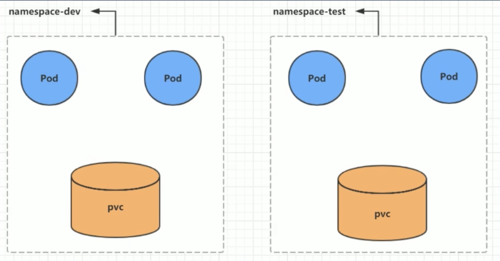
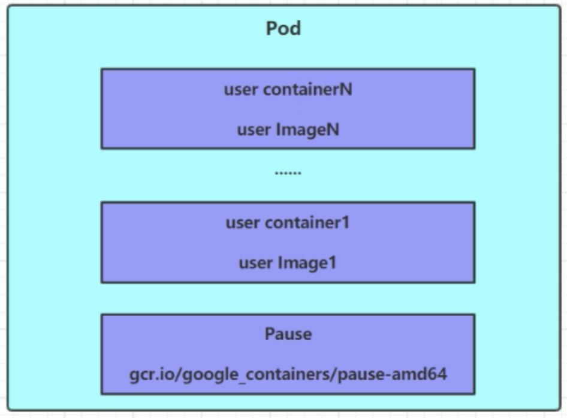
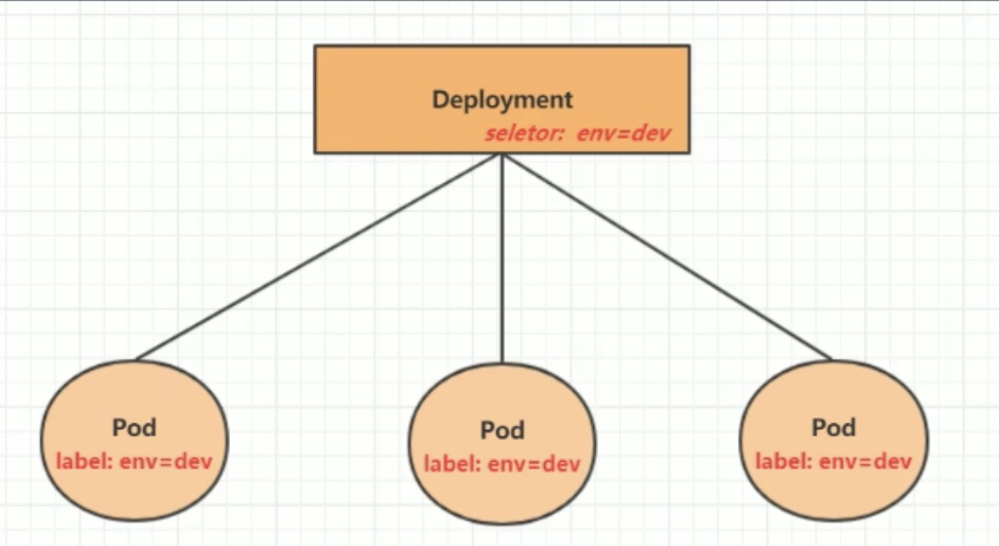

# kubernetes实战入门
## 4.1 Namespace
&nbsp;&nbsp;&nbsp;&nbsp;Namespace 是 kubernetes 系统中的一种非常重要资源, 他的主要作用是用来实现**多套环境的资源隔离**或者**多租户的资源隔离**.

&nbsp;&nbsp;&nbsp;&nbsp;默认情况下, kubernetes集群中的所有Pod都是可以互相访问的, 但是在实际中, 可能不想让两个Pod之间进行互相的访问, 那此时就可以将两个Pod划分到不同的namespace下, kubernetes通过将集群内部的资源分配到不同的namespace中,可以形成逻辑上的"组", 以方便不同的组的资源进行隔离使用和管理.

&nbsp;&nbsp;&nbsp;&nbsp;可以通过kubernetes的授权机制, 将不同的namespace交给不同租户进行管理, 这样就实现了多租户的资源隔离, 此时还能结合kubernetes的资源配额机制, 限定不同的租户能占用的资源, 例如:CPU使用量,内存使用量等等, 来实现租户可用资源的管理



kubernetes在集群启动之后, 会默认创建几个namespace
```
[root@master ~]# kubectl get ns
NAME              STATUS   AGE      
default           Active   4d       # 所有未指定Namespace的对象都会被分配到default命名空间中
kube-flannel      Active   3d23h    # 
kube-node-lease   Active   4d       # 集群节点之间的心跳维护, v1.13开始引入
kube-public       Active   4d       # 命名空间下的资源可以被所有人访问(包括未认证用户)
kube-system       Active   4d       # 所有有Kubernetes系统创建的资源都处于这个命名空间(k8s组件)
```
下面来看 namespace 资源的具体操作: 
**查看**
```shell
# 1. 查看所有的namespace 命令: kubectl get ns
[root@master ~]# kubectl get ns
NAME              STATUS   AGE
default           Active   4d
kube-flannel      Active   3d23h
kube-node-lease   Active   4d
kube-public       Active   4d
kube-system       Active   4d

# 2. 查看指定的 namespace 命令: kubectl get ns ns名称
[root@master ~]# kubectl get ns default
NAME      STATUS   AGE
default   Active   4d1h

# 3. 指定输出格式 命令: kubectl get ns ns名称 -o 格式参数
# kubernetes支持的格式有很多吗比较常见的是 wide, json, yaml
[root@master ~]# kubectl get ns default -o yaml
apiVersion: v1
kind: Namespace
metadata:
  creationTimestamp: "2022-11-10T06:18:39Z"
  name: default
  resourceVersion: "145"
  selfLink: /api/v1/namespaces/default
  uid: 9d636868-3446-4325-969c-724c32da1a30
spec:
  finalizers:
  - kubernetes
status:
  phase: Active 

# 4. 查看namespace详情 命令: kubectl describe ns ns名称
[root@master ~]# kubectl describe ns default
Name:         default
Labels:       <none>  # 标签
Annotations:  <none>  # 注解
Status:       Active  # Active 命名空间正在使用中 Terminating 正在删除命名空间

# ResourceQuota 针对 namespace 做的资源限制
# LimitRange 针对 namespace 中的每个组件做的资源限制
No resource quota.
No LimitRange resource.
```

**创建**
```
# 创建namespace
[root@master ~]# kubectl  create namespace dev
namespace/dev created

```

**删除**
```
[root@master ~]# kubectl delete ns dev
namespace "dev" deleted
```

**配置方式**
首先准备一个yaml文件: ns-dev.yaml 
```yaml
apiVersion: v1
kind: Namespace
metadata: 
  name: dev
```
然后就可以执行对应的创建和删除命令了: 
```
    创建: kubectl create -f ns-dev.yaml
    删除: kubectl delete -f ns-dev.yaml
```

## 4.2 Pod
Pod 是kubernetes集群进行管理的最小单元, 程序要运行必须部署在容器中, 而容器必须存在于Pod中
Pod 可以认为是容器的封装, 一个Pod中可以存在一个或者多个容器.


kubernetes在集群启动之后, 集群中的各个组件也都是以Pod方式运行的.可以通过下面命令查看: 
```shell
# 查看所有的namespace
[root@master ~]# kubectl  get ns 
NAME              STATUS   AGE
default           Active   4d2h
kube-flannel      Active   4d1h
kube-node-lease   Active   4d2h
kube-public       Active   4d2h
kube-system       Active   4d2h

# 查看某个 namespace 中的 pod (kubernetes中的组件运行在 kube-system namespace 中的)
[root@master ~]#  kubectl get pod -n kube-system
NAME                             READY   STATUS             RESTARTS   AGE
coredns-9d85f5447-c6pkc          0/1     CrashLoopBackOff   158        4d2h
coredns-9d85f5447-nkd6z          0/1     CrashLoopBackOff   157        4d2h
etcd-master                      1/1     Running            0          4d2h
kube-apiserver-master            1/1     Running            0          4d2h
kube-controller-manager-master   1/1     Running            0          4d2h
kube-proxy-lsgbt                 1/1     Running            0          4d2h
kube-proxy-p6bff                 1/1     Running            0          4d1h
kube-proxy-qxbmb                 1/1     Running            0          4d1h
kube-scheduler-master            1/1     Running            0          4d2h
[root@master ~]#
```

**创建并运行**
kubernetes没有提供单独运行Pod的命令, 都是通过Pod控制器来实现的
```shell
# 命令格式: kubectl run (pod控制器名称) [参数]
# --image: 指定Pod的镜像
# --port: 指定端口
# --namespace: 指定namespace

# 创建一个 namespace 
[root@master ~]# kubectl create ns dev
namespace/dev created

# 创建运行
[root@master ~]# kubectl run nginx  --image=nginx:1.17.1 --port=80 --namespace dev
kubectl run --generator=deployment/apps.v1 is DEPRECATED and will be removed in a future version. Use kubectl run --generator=run-pod/v1 or kubectl create instead.
deployment.apps/nginx created
```

**查看pod信息**
```
# 查看Pod基本信息
[root@master ~]# kubectl get pod -n dev
NAME                     READY   STATUS    RESTARTS   AGE
nginx-64777cd554-cgd6k   1/1     Running   0          2m49s

# -o wide||json||yaml
[root@master ~]# kubectl get pod -n dev -o wide
NAME                     READY   STATUS    RESTARTS   AGE     IP           NODE    NOMINATED NODE   READINESS GATES
nginx-64777cd554-cgd6k   1/1     Running   0          2m53s   10.244.1.4   node1   <none>           <none>

# 查看Pod的详细信息
[root@master ~]# kubectl describe pod -n dev
Name:         nginx-64777cd554-cgd6k
Namespace:    dev
Priority:     0
Node:         node1/192.168.111.101
Start Time:   Mon, 14 Nov 2022 16:28:07 +0800
Labels:       pod-template-hash=64777cd554
              run=nginx
Annotations:  <none>
Status:       Running
IP:           10.244.1.4
IPs:
  IP:           10.244.1.4
Controlled By:  ReplicaSet/nginx-64777cd554
Containers:
  nginx:
    Container ID:   docker://fadf632e4b47cf5262c3a5ef67525970a7d677d8a7924471ae1e53dfa65c9333
    Image:          nginx:1.17.1
    Image ID:       docker-pullable://nginx@sha256:b4b9b3eee194703fc2fa8afa5b7510c77ae70cfba567af1376a573a967c03dbb
    Port:           80/TCP
    Host Port:      0/TCP
    State:          Running
      Started:      Mon, 14 Nov 2022 16:28:29 +0800
    Ready:          True
    Restart Count:  0
    Environment:    <none>
    Mounts:
      /var/run/secrets/kubernetes.io/serviceaccount from default-token-2sbmc (ro)
Conditions:
  Type              Status
  Initialized       True 
  Ready             True 
  ContainersReady   True 
  PodScheduled      True 
Volumes:
  default-token-2sbmc:
    Type:        Secret (a volume populated by a Secret)
    SecretName:  default-token-2sbmc
    Optional:    false
QoS Class:       BestEffort
Node-Selectors:  <none>
Tolerations:     node.kubernetes.io/not-ready:NoExecute for 300s
                 node.kubernetes.io/unreachable:NoExecute for 300s
Events:
  Type    Reason     Age    From               Message
  ----    ------     ----   ----               -------
  Normal  Scheduled  3m32s  default-scheduler  Successfully assigned dev/nginx-64777cd554-cgd6k to node1
  Normal  Pulling    3m31s  kubelet, node1     Pulling image "nginx:1.17.1"
  Normal  Pulled     3m11s  kubelet, node1     Successfully pulled image "nginx:1.17.1"
  Normal  Created    3m10s  kubelet, node1     Created container nginx
  Normal  Started    3m10s  kubelet, node1     Started container nginx
```

**Pod访问**
```
# 获取podIP
[root@master ~]# kubectl get pod -n dev -o wide
NAME                     READY   STATUS    RESTARTS   AGE     IP           NODE    NOMINATED NODE   READINESS GATES
nginx-64777cd554-cgd6k   1/1     Running   0          2m53s   10.244.1.4   node1   <none>           <none>

# 访问Pod

```

**删除指定Pod**
```
# 删除指定的Pod
[root@master ~]# kubectl delete pod nginx-64777cd554-cgd6k -n dev
pod "nginx-64777cd554-cgd6k" deleted

# 此时, 显示删除Pod成功, 但是再查询, 发现又新产生了一个
[root@master ~]# kubectl get pod -n dev -o wide
NAME                     READY   STATUS    RESTARTS   AGE   IP           NODE    NOMINATED NODE   READINESS GATES
nginx-64777cd554-d9wvs   1/1     Running   0          64s   10.244.1.5   node1   <none>           <none>

# 这是因为当前Pod是由Pod控制器创建的, 控制器会监控Pod状况, 一但发现Pod死亡, 会立即重建
# 此时要想要删除Pod, 必须删除Pod控制器

# 先来查询一下当前 namespace 下的Pod控制器
[root@master ~]# kubectl get deploy -n dev
NAME    READY   UP-TO-DATE   AVAILABLE   AGE
nginx   1/1     1            1           48m

# 接下来, 删除此Pod控制器
[root@master ~]# kubectl delete deploy nginx -n dev
deployment.apps "nginx" deleted

# 稍等片刻, 在查询Pod, 发现Pod被删除了
[root@master ~]# kubectl get pod  -n dev
No resources found in dev namespace.

```
**配置操作**
创建一个pod-nginx.yaml, 内容如下: 
```yaml
apiVersion: v1
kind: Pod
metadata: 
  name: nginx
  namespace: dev
spec: 
  containers: 
  - image: nginx:1.17.1
    imagePullPolicy: IfNotPresent
    name: pod
    ports: 
    - name: nginx-port
      containerPort: 80
      protocol: TCP
```
然后就可以执行对应的创建和删除命令了: 
```
    创建: kubectl create -f pod-nginx.yaml
    删除: kubectl delete -f pod-nginx.yaml
    # 这种方式运行, 就是启动一个pod, 而不是deploy控制器
```

## 4.3 Label
Label是kubernetes系统中的一个重要的概念, 它的作用就是在资源上添加表示, 用来对它们进行区分和选择.

Label的特点: 

- 一个Label会以 key/value 键值对的形式附加到各种对象上, 如Node, Pod, Service等等
- 一个资源对象可以定义任意数量的Label, 同一个Label也可以被添加到任意数量的资源对象上去
- Label通常在资源对象定义时确定, 当然也可以在对象创建后动态添加或删除

可以通过Label实现资源的多维度分组, 以便灵活, 方便地进行资源分配, 调度, 配置, 部署等管理工作.
> 一些常用的Label示例如下: 
>- 版本标签: "version", "release", "version": "stable"......
>- 环境标签: "environment":"dev", "environment":"test", "environment":"pro"
>- 架构标签: "tier":"frontend", "tier": "backend"

标签定义完毕之后, 还要考虑到标签的选择, 这就要使用到Label Selector, 即: 
- Label 用于给某个资源对象定义标识
- Label Selector用于查询和筛选拥有某些标签的资源对象

当有两种Label Selector: 
- 基于等式的 Label Selector
    name = slave: 选择所有包含Label中key="name" 且value="slave"的对象
    env != production: 选择所有包括Label中的key="env"且value不等于"production"的对象
- 基于集合的Label Selector
    name in (master, slave): 选择所有包含Label中的key="name"且value="master"或"slave"的对象
    name not in (frontend): 选择所有包含Label中的key="name"且value不等于"frontend"的对象

标签的选择条件可以使用多个, 此时将多个Label Selector进行组合, 使用逗号","进行分隔即可, 例如: 

    name=slave, env!=production
    name not in (frontend), env!=production

**操作演示**
```shell
# 查看 pod 的标签
[root@master ~]# kubectl get pod -n dev --show-labels
NAME    READY   STATUS    RESTARTS   AGE   LABELS
nginx   1/1     Running   0          10s   <none>

# 给 pod 添加标签(标签可以有多个)
[root@master ~]# kubectl label pod nginx -n dev version=1.0
pod/nginx labeled

# 更新标签 --overwrite
[root@master ~]# kubectl label pod nginx -n dev version=2.0 --overwrite
pod/nginx labeled

# 筛选标签
[root@master ~]# kubectl get  pod -l "version=2.0" -n dev --show-labels
NAME    READY   STATUS    RESTARTS   AGE     LABELS
nginx   1/1     Running   0          8m31s   version=2.0
# 也可以使用 != 
[root@master ~]# kubectl get  pod -l "version!=2.0" -n dev --show-labels
No resources found in dev namespace.
[root@master ~]# 

# 删除标签
[root@master ~]# kubectl label pod nginx -n dev version- 
pod/nginx labeled
```

**配置方式**
```yaml
apiVersion: v1
kind: Pod
metadata: 
  name: nginx
  namespace: dev
  labels: 
    version: "3.0"
    env: "test"
spec: 
  containers: 
  - image: nginx:1.17.1
    name: pod
    ports: 
    - name: nginx-port
      containerPort: 80
      protocol: TCP
```
然后就可以执行对应的更新命令了: kubectl apply -f pod-nginx.yaml 


## 4.4 Deployment 
在kubernetes中, Pod是最小的控制单元, 但是kubernetes很少直接控制Pod, 一般都是通过Pod控制器来完成的, Pod控制器用于Pod的管理,确保pod资源符合预期的状态, 当pod的资源出现故障时, 会尝试进行重启或重建pod.

&nbsp;&nbsp;&nbsp;&nbsp;在kubernetes中Pod控制器的种类有很多, 本章节只介绍一种: Deployment.



**命令操作**
```shell
# 命令格式: kubectl run deployment名称 [参数]
# --image:  指定pod镜像
# --port:   指定端口
# --replicas:  指定创建pod数量
# --namespace:  指定namespace


[root@master ~]# kubectl run nginx --image=nginx:1.17.1 --replicas=3 --port=80 -n dev
kubectl run --generator=deployment/apps.v1 is DEPRECATED and will be removed in a future version. Use kubectl run --generator=run-pod/v1 or kubectl create instead.
deployment.apps/nginx created


# 查看创建的pod
[root@master ~]# kubectl get pod -n dev
NAME                     READY   STATUS    RESTARTS   AGE
nginx-64777cd554-ptc65   1/1     Running   0          88s
nginx-64777cd554-qbslm   1/1     Running   0          88s
nginx-64777cd554-tbpc9   1/1     Running   0          88s


# 查看deployment的信息
[root@master ~]# kubectl get deploy -n dev
NAME    READY   UP-TO-DATE   AVAILABLE   AGE
nginx   3/3     3            3           2m15s


# UP-TO-DATE: 成功升级的副本数量
# AVAILABLE: 可用的副本数量
[root@master ~]# kubectl get deploy -n dev -o wide
NAME    READY   UP-TO-DATE   AVAILABLE   AGE     CONTAINERS   IMAGES         SELECTOR
nginx   3/3     3            3           9m16s   nginx        nginx:1.17.1   run=nginx


# 查看 deplyment 的详细信息
[root@master ~]# kubectl describe deploy -n dev
Name:                   nginx
Namespace:              dev
CreationTimestamp:      Tue, 15 Nov 2022 13:42:57 +0800
Labels:                 run=nginx
Annotations:            deployment.kubernetes.io/revision: 1
Selector:               run=nginx
Replicas:               3 desired | 3 updated | 3 total | 3 available | 0 unavailable
StrategyType:           RollingUpdate
MinReadySeconds:        0
RollingUpdateStrategy:  25% max unavailable, 25% max surge
Pod Template:
  Labels:  run=nginx
  Containers:
   nginx:
    Image:        nginx:1.17.1
    Port:         80/TCP
    Host Port:    0/TCP
    Environment:  <none>
    Mounts:       <none>
  Volumes:        <none>
Conditions:
  Type           Status  Reason
  ----           ------  ------
  Available      True    MinimumReplicasAvailable
  Progressing    True    NewReplicaSetAvailable
OldReplicaSets:  <none>
NewReplicaSet:   nginx-64777cd554 (3/3 replicas created)
Events:
  Type    Reason             Age   From                   Message
  ----    ------             ----  ----                   -------
  Normal  ScalingReplicaSet  10m   deployment-controller  Scaled up replica set nginx-64777cd554 to 3


# 删除
[root@master ~]# kubectl delete deployment nginx -n dev 
deployment.apps "nginx" deleted
# 再次查看
[root@master ~]# kubectl get deploy,pod -n dev
No resources found in dev namespace.
```


**配置操作**
创建一个deploy-nginx.yaml, 内容如下
```yaml
apiVersion: apps/v1
kind: Deployment
metadata: 
  name: nginx
  namespace: dev
spec: 
  replicas: 3 
  selector: 
    matchLabels:
      run: nginx
  template: 
    metadata: 
      labels: 
        run: nginx
    spec: 
      containers: 
      - image: nginx:1.17.1
        name: nginx
        ports: 
        - containerPort: 80
          protocol: TCP
```
然后就可以执行对应的创建和删除命令了: 
```
    创建: kubectl create -f deploy-nginx.yaml
    删除: kubectl delete -f deploy-nginx.yaml
```
**selector => 标签选择器, 通过Pod模板匹配 => labels**


## 4.5 Service
通过上节课的学习, 已经能够利用Deployment来创建一组Pod来提供具有高可用性的服务
虽然每个Pod都会分配一个独立的Pod IP, 然而却存在如下两个问题: 
- Pod IP 会随着Pod的重建产生变化
- Pod IP 仅仅是集群内可见的虚拟IP, 外部无法访问

这样对于访问这个服务带来了难度, 因此, kubernetes设计了Service来解决这个问题.
Service可以看做是一组同类Pod**对外的访问接口**. 借助Service, 应用可以方便地实现服务发现和负载均衡.


**操作一: 创建集群内部可访问的Service**
```shell
# 暴露 Service
[root@master ~]# kubectl expose deploy nginx --name=svc-nginx1 --type=ClusterIP --port=80 --target-port=80 -n dev
service/svc-nginx1 exposed

# 查看service
[root@master ~]# kubectl get svc -n dev -o wide
NAME         TYPE        CLUSTER-IP       EXTERNAL-IP   PORT(S)   AGE   SELECTOR
svc-nginx1   ClusterIP   10.101.129.236   <none>        80/TCP    25m   run=nginx


# 这里产生了一个 CLUSTER-IP, 这个就是service的IP, 在Service的声明周期中, 这个地址是不会变的
# 可以通过这个IP, 访问当前service对应的POD
[root@master ~]# curl 10.101.129.236:80 
<!DOCTYPE html>
<html>
<head>
<title>Welcome to nginx!</title>
<style>
    body {
        width: 35em;
        margin: 0 auto;
        font-family: Tahoma, Verdana, Arial, sans-serif;
    }
</style>
</head>
<body>
<h1>Welcome to nginx!</h1>
<p>If you see this page, the nginx web server is successfully installed and
working. Further configuration is required.</p>

<p>For online documentation and support please refer to
<a href="http://nginx.org/">nginx.org</a>.<br/>
Commercial support is available at
<a href="http://nginx.com/">nginx.com</a>.</p>

<p><em>Thank you for using nginx.</em></p>
</body>
</html>


```

**操作二: 创建集群外部也可以访问的Service**
```shell
# 上面创建的 Service的type类型为ClusterTP, 这个IP地址只用集群内部可访问
# 如果需要创建外部也可以访问的Service, 需要修改type为NodePort
[root@master ~]# kubectl expose deploy nginx --name=svc-nginx1 --type=NodePort --port=80 --target-port=80 -n dev
service/svc-nginx1 exposed


# 此时查看, 会发现出现了 NodePort 类型的 Service, 而且有一对Port (80:30456/TCP)
[root@master ~]# kubectl get svc -n dev -o wide
NAME         TYPE       CLUSTER-IP      EXTERNAL-IP   PORT(S)        AGE   SELECTOR
svc-nginx1   NodePort   10.103.227.51   <none>        80:30456/TCP   22s   run=nginx


# 接下来就可以通过集群外的主机访问, 节点IP:31928访问服务了
# 例如在电脑主机上通过浏览器访问下面的地址
http://192.168.111.100:31928/
```

**删除Service**
```
[root@master ~]# kubectl delete svc svc-nginx1 -n dev 
service "svc-nginx1" deleted
```

**配置方式**
创建一个svc-nginx.yaml, 内容如下💯: 
```yaml
apiVersion: v1
kind: Service
metadata: 
  name: svc-nginx
  namespace: dev
spec:  
  clusterIP: ~ 
  ports: 
  - port: 80
    protocol: TCP
    targetPort: 80
  selector: 
    run: nginx
  type: ClusterIP
```
然后就可以执行对应的创建和删除命令了: 
```
    创建: kubectl create -f svc-nginx.yaml
    删除: kubectl delete -f svc-nginx.yaml
```

> **小结**
> 至此, 已经掌握了NameSpace, Pod, Deployment, Service资源的基本操作, 有了这些操作, 就可以在kubernetes集群中实现一个服务的简单部署和访问了, 但是如果想要更好的使用kubernetes, 就需要深入学习这几种资源的细节和原理

