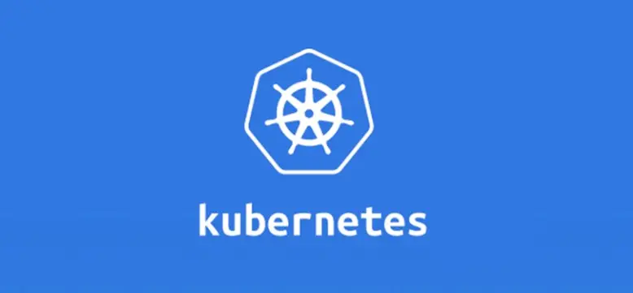
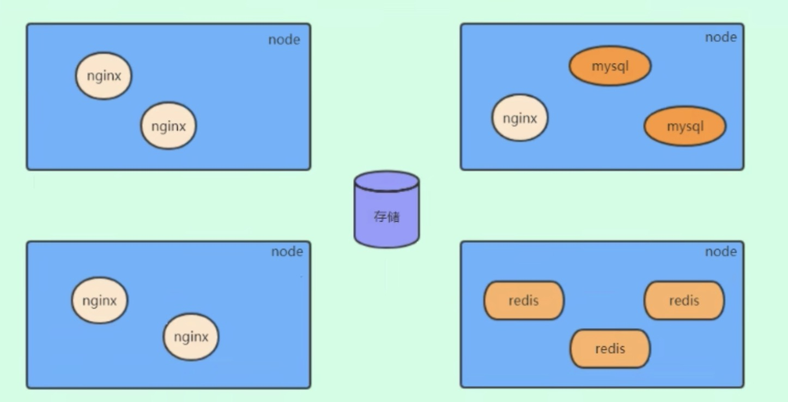
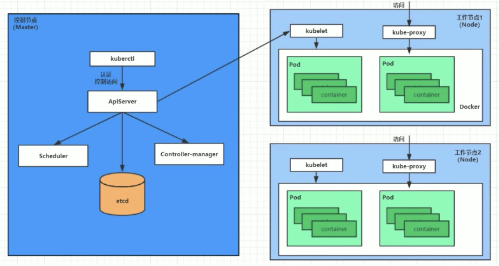
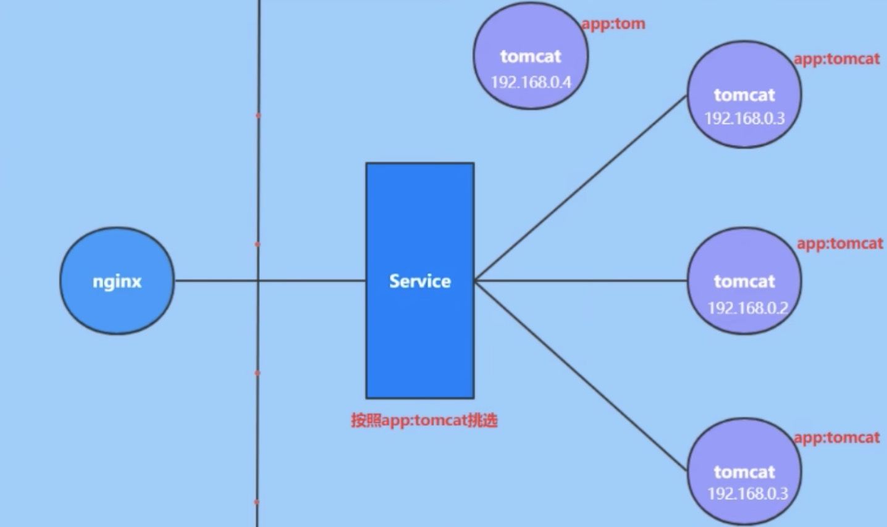

# kubernetes简介

> **kubernetes** 是一个全新的基于容器技术的分布式架构领先方案
> 是谷歌严格保密十几年的秘密武器----Borg系统的开源版本
> 与2014年9月发布第一个版本, 2015年七月发布第一个正式版本

> **kubernetes** 的本质是 **一组服务器集群** , 
> 他可以在集群的每个节点上运行特定的程序, 来对节点中的容器进行管理. 
> 他的目的就是实现资源管理的自动化, 主要提供了如下功能:

- **自动修复**: 一旦某个容器崩溃, 能够在一秒中左右迅速重新启动容器
- **弹性伸缩**: 可以根据需要, 自动对集群中正在运行的容器数量进行调整
- **服务发现**: 服务可以通过自动发现的形式找到它所依赖的服务
- **负载均衡**: 如果一个服务启动了多个容器, 能够自动实现请求负载均衡
- **版本回退**: 如果发现新发布的程序版本有问题, 可以立即回退到原来的版本
- **存储编排**: 可以根据容器自身的需求自动创建存储卷
```
关键词: 
    node: 节点
```

## 1.1 kubernetes 组件
    一个 kubernetes 集群主要由控制节点(master), 工作节点(node)构成, 每个节点上都会安装不同的组件
**master: 集群的控制平面, 负责集群的决策(管理者)**
> **ApiServer**: 资源操作的唯一入口, 接收用户输入的命令, 提供认证, 授权, API注册和发现机制
> **Scheduler**: 负责集群资源调度, 按照预定的调度策略将 Pod 调度到响应的 node 节点上
> **ControllerManager**: 负责维护集群的状态, 比如程序部署安排, 故障检测, 自动扩展, 滚动更新等
> **Etcd**: 负责存储集群中各种资源对象的信息

**node: 集群的数据平面, 负责为容器提供运行环境(工作者 )**
> **Kubelet**: 负责维护容器的声明周期, 即通过控制docker, 来创建, 更新, 销毁容器
> **KubeProxy**: 负责提供集群内部的服务发现和负载均衡
> **Docker**: 负责节点上容器的各种操作



以部署一个 **nginx** 服务来说明 kubernetes 系统各个组件的调用关系:
- 1. 首先要明确, 一旦kubernetes换将启动后, master和node都会将自身信息存储到etcd数据库中
- 2. 一个nginx服务的安装请求会首先被发送到master节点的apiServer组件
- 3. apiServer组件会调用scheduler组件来决定到底应该把服务安装到哪个节点上,
     在此时, 它会从etcd中读取各个node节点的信息,  然后一直按照一定的算法进行选择, 并将结果告知apiServer
- 4. apiServer 调用controller-manager去调度Node节点安装nginx
- 5. kubelet接收到指令后, 会通知docker, 然后docker来启动一个nginx的pod
     pod是kubernetes的最小操作单元, 容器必须跑在pod中至此
- 6. 一个nginx服务就运行了, 如果需要访问nginx, 就需要通过 kube-proxy 来对pod产生访问的代理
     这样外界用户就可以访问集群中的nginx服务了

## 1.2 kubernetes 概念
- ***Master***: 集群控制节点, 每个集群需要至少一个master节点负责集群的管控
- ***Node***: 工作负载节点, 由master分配容器到这些node节点上, 然后node节点上的docker负责运行
- ***Pod***:  kubernetes的最小控制单元, 容器都是运行在pod中的, 一个pod中可以有1个或者多个容器
- ***Controller***: 控制器(**有多种**), 通过它来实现对pod的管理, 比如启动pod, 停止pod, 伸缩pod的数量等等
- ***Service***: pod对外服务的统一入口, 下面可以维护者同一类的多个pod
- ***label***: 标签, 用于对pod进行分类, 同一类pod会拥有相同的标签
- ***NameSpace***: 命名空间, 用来隔离pod的运行环境


